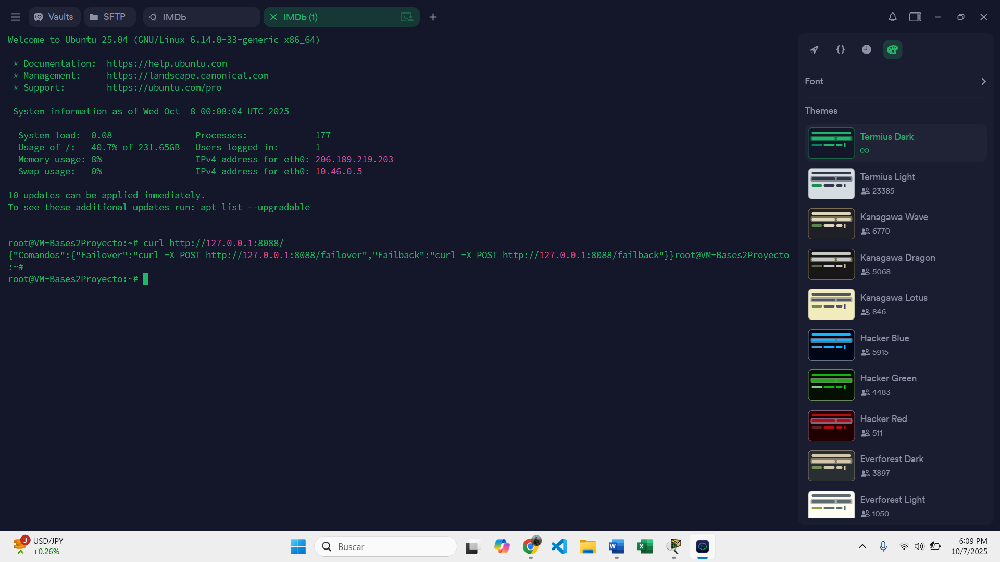
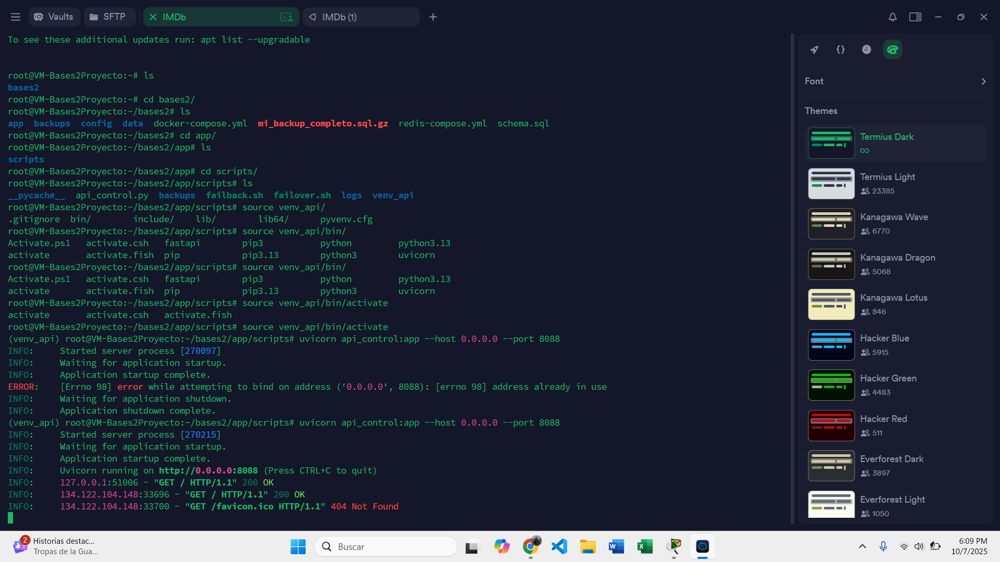
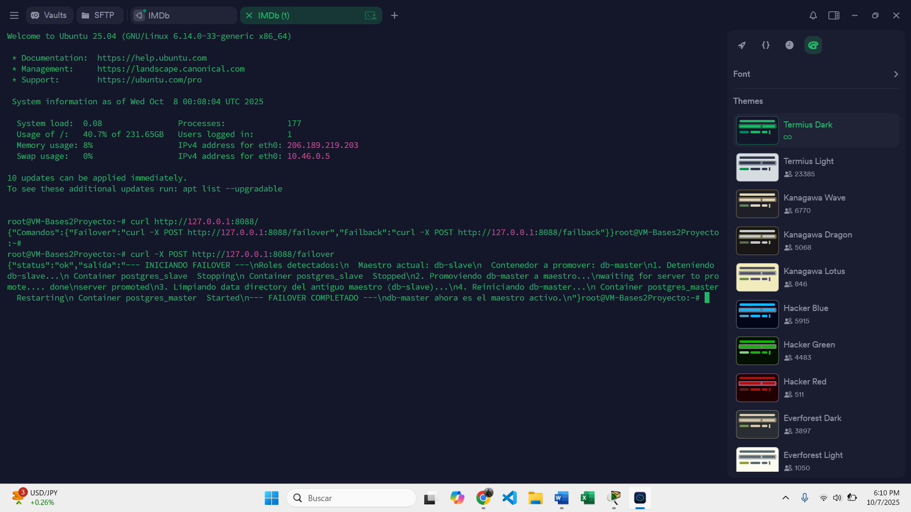
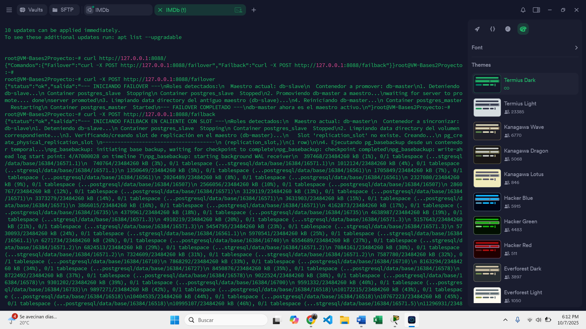

# MANUAL DE USUARIO
## Sistema de Replicación PostgreSQL con Alta Disponibilidad

---

##  Tabla de Contenidos

1. [Introducción](#introducción)
2. [Requisitos Previos](#requisitos-previos)
3. [Instalación Inicial](#instalación-inicial)
4. [Ejecución de la API de Control](#ejecución-de-la-api-de-control)
5. [Operaciones Principales](#operaciones-principales)
6. [Verificación del Sistema](#verificación-del-sistema)
7. [Gestión de Backups](#gestión-de-backups)
8. [Solución de Problemas](#solución-de-problemas)

---

## Introducción

Este manual está diseñado para guiar a los usuarios en la operación del sistema de alta disponibilidad para PostgreSQL. El sistema permite gestionar la replicación de bases de datos, realizar operaciones de failover/failback y administrar backups de manera automática.

### ¿Qué puedes hacer con este sistema?

- Mantener dos servidores PostgreSQL sincronizados (maestro-esclavo)
- Cambiar automáticamente al servidor de respaldo en caso de falla (failover)
- Volver al servidor original sin pérdida de datos (failback)
- Realizar backups automáticos diarios
- Consultar el estado de las réplicas y backups

---

## Requisitos Previos

Antes de comenzar, asegúrate de tener instalado:

- **Docker** (versión 20.10 o superior)
- **Docker Compose** (versión 3.8 o superior)
- **Sistema Operativo**: Linux (Ubuntu/Debian recomendado)
- **Permisos**: Usuario con permisos sudo

### Verificar instalaciones

```bash
docker --version
docker-compose --version
```

---

## Instalación Inicial

### Paso 1: Clonar o descargar el proyecto

Navega al directorio donde se encuentra el proyecto:

```bash
cd /ruta/al/proyecto/Fase2
```

### Paso 2: Estructura del proyecto


El proyecto tiene la siguiente organización:

```
Fase2/
├── app/
│   └── scripts/
│       ├── api_control.py
│       ├── failover.sh
│       ├── failback.sh
│       └── backups/
├── config/
│   ├── master/
│   └── slave/
└── docker-compose.yml
```

### Paso 3: Iniciar los contenedores

Para iniciar todo el sistema, ejecuta:

```bash
docker-compose up -d
```


Verifica que todos los contenedores estén corriendo:

```bash
docker-compose ps
```


---

## Ejecución de la API de Control

La API de control te permite ejecutar operaciones de failover y failback de manera remota.

### Ubicación

Primero, navega al directorio de scripts:

```bash
cd /ruta/al/proyecto/Fase2/app/scripts
```

### Activar el entorno virtual

```bash
source venv_api/bin/activate
```

### Iniciar la API

Ejecuta el siguiente comando para iniciar el servidor API:

```bash
uvicorn api_control:app --host 0.0.0.0 --port 8088
```





Una vez iniciada, la API estará disponible en `http://127.0.0.1:8088`

### Verificar comandos disponibles

En otra terminal, puedes consultar los comandos disponibles:

```bash
curl http://127.0.0.1:8088/
```


La respuesta mostrará:

```json
{
  "Comandos": {
    "Failover": "curl -X POST http://127.0.0.1:8088/failover",
    "Failback": "curl -X POST http://127.0.0.1:8088/failback"
  }
}
```

---

## Operaciones Principales

### 1. Ejecutar Failover

El **failover** cambia automáticamente del servidor maestro al esclavo en caso de falla.

#### Cuándo usar failover:

- El servidor maestro ha fallado
- Necesitas realizar mantenimiento en el servidor maestro
- Detectas problemas de rendimiento en el maestro

#### Ejecutar failover:

```bash
curl -X POST http://127.0.0.1:8088/failover
```



#### Resultado esperado:

```json
{
  "status": "success",
  "message": "Failover completado exitosamente"
}
```

### 2. Ejecutar Failback

El **failback** restaura el servidor original como maestro después de un failover.

#### Cuándo usar failback:

- El servidor original ya está operativo
- Has terminado el mantenimiento
- Quieres volver a la configuración original

#### Ejecutar failback:

```bash
curl -X POST http://127.0.0.1:8088/failback
```



#### Resultado esperado:

```json
{
  "status": "success",
  "message": "Failback completado exitosamente"
}
```

---

## Verificación del Sistema

### Verificar estado de replicación

Conéctate al servidor maestro:

```bash
docker exec -it postgres_master psql -U postgres
```

Ejecuta la siguiente consulta:

```sql
SELECT * FROM pg_stat_replication;
```


### Verificar rol de los servidores

Para saber si un servidor es maestro o esclavo:

```sql
SELECT pg_is_in_recovery();
```

- **false**: El servidor es maestro
- **true**: El servidor es esclavo


### Verificar lag de replicación

```sql
SELECT 
    application_name,
    client_addr,
    state,
    sync_state,
    replay_lag
FROM pg_stat_replication;
```


---

## Gestión de Backups

### Sistema de backups automáticos

El sistema realiza backups diarios automáticamente:

- **Día 1**: Backup completo
- **Días 2-6**: Backups incrementales

### Verificar backups realizados

Los backups se almacenan en:

```bash
ls -lh /ruta/al/proyecto/Fase2/backups/
```


### Consultar metadatos en Redis

Conéctate a Redis:

```bash
docker exec -it redis redis-cli
```

Ver todas las claves de backups:

```redis
KEYS backup:*
```


Ver información de un backup específico:

```redis
HGETALL backup:completo:2025-10-08
```

### Restaurar un backup

Para restaurar un backup completo:

```bash
# Detener el servidor
docker-compose stop postgres_master

# Restaurar el backup
docker exec -i postgres_master psql -U postgres < /backups/backup_completo_20251008.sql.gz

# Reiniciar el servidor
docker-compose start postgres_master
```


---

## Solución de Problemas

### Problema 1: La API no inicia

**Síntoma**: Error al ejecutar `uvicorn api_control:app`

**Solución**:

```bash
# Verificar que estás en el directorio correcto
pwd
# Debe mostrar: /ruta/al/proyecto/Fase2/app/scripts

# Verificar que el entorno virtual está activado
which python
# Debe mostrar: /ruta/al/venv_api/bin/python

# Reinstalar dependencias
pip install fastapi uvicorn
```

### Problema 2: Failover falla

**Síntoma**: El comando failover retorna error

**Solución**:

```bash
# Verificar logs del script
cat /app/scripts/logs/failover.log

# Verificar estado de los contenedores
docker-compose ps

# Reiniciar contenedores si es necesario
docker-compose restart
```


### Problema 3: Lag de replicación alto

**Síntoma**: El `replay_lag` es mayor a 5 segundos

**Solución**:

```bash
# Verificar recursos del sistema
docker stats

# Verificar conexión de red entre contenedores
docker exec postgres_master ping postgres_slave

# Revisar configuración de WAL
docker exec postgres_master cat /var/lib/postgresql/data/postgresql.conf | grep wal
```

### Problema 4: Backup no se ejecuta

**Síntoma**: No hay backups nuevos en el directorio

**Solución**:

```bash
# Verificar logs de backups
cat /app/scripts/logs/backups.log

# Ejecutar backup manualmente
docker exec -it postgres_master /app/scripts/backups/dia1.sh

# Verificar permisos del directorio
ls -la /backups/
```

---

## Comandos Útiles de Referencia

### Docker

```bash
# Ver logs de un contenedor
docker logs postgres_master

# Acceder a la terminal de un contenedor
docker exec -it postgres_master bash

# Detener todos los servicios
docker-compose down

# Reiniciar un servicio específico
docker-compose restart postgres_master
```

### PostgreSQL

```bash
# Conectarse a PostgreSQL
docker exec -it postgres_master psql -U postgres

# Ver bases de datos
\l

# Ver tablas de una base de datos
\dt

# Salir de psql
\q
```

### Redis

```bash
# Conectarse a Redis
docker exec -it redis redis-cli

# Ver todas las claves
KEYS *

# Limpiar toda la base de datos (¡cuidado!)
FLUSHALL
```

---

## Contacto y Soporte

Para problemas o consultas adicionales, contacta al equipo de soporte técnico o consulta la documentación técnica completa.

**Versión del Manual**: 1.0  
**Fecha**: Octubre 2025  
**Proyecto**: Fase 2 - Sistema de Replicación PostgreSQL con HA