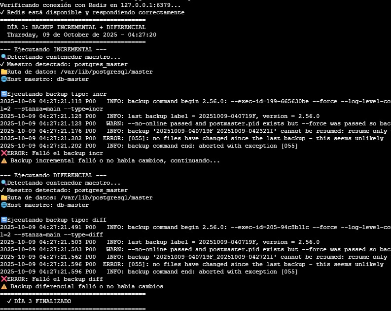
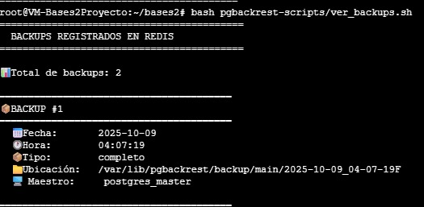
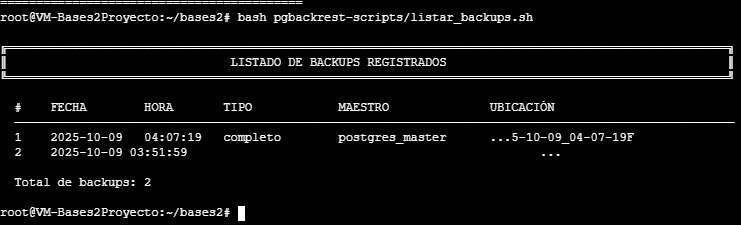

# MANUAL DE USUARIO
## Sistema de Replicación PostgreSQL con Alta Disponibilidad


## Introducción

Este manual está diseñado para guiar a los usuarios en la operación del sistema de alta disponibilidad para PostgreSQL. El sistema permite gestionar la replicación de bases de datos, realizar operaciones de failover/failback y administrar backups de manera automática.

### ¿Qué puedes hacer con este sistema?

- Mantener dos servidores PostgreSQL sincronizados (maestro-esclavo)
- Cambiar automáticamente al servidor de respaldo en caso de falla (failover)
- Volver al servidor original sin pérdida de datos (failback)
- Realizar backups automáticos diarios
- Consultar el estado de las réplicas y backups

---

## Requisitos Previos

Antes de comenzar, asegúrate de tener instalado:

- **Docker** (versión 20.10 o superior)
- **Docker Compose** (versión 3.8 o superior)
- **Sistema Operativo**: Linux (Ubuntu/Debian recomendado)
- **Permisos**: Usuario con permisos sudo

### Verificar instalaciones

```bash
docker --version
docker-compose --version
```

---

## Instalación Inicial

### Paso 1: Clonar o descargar el proyecto

Navega al directorio donde se encuentra el proyecto:

```bash
cd /ruta/al/proyecto/Fase2
```

### Paso 2: Estructura del proyecto


El proyecto tiene la siguiente organización:

```
Fase2/
├── app/
│   └── scripts/
│       ├── api_control.py
│       ├── failover.sh
│       ├── failback.sh
│       └── backups/
├── config/
│   ├── master/
│   └── slave/
└── docker-compose.yml
```


## Ejecución de la API de Control

La API de control te permite ejecutar operaciones de failover y failback de manera remota.

### Ubicación

Primero, navega al directorio de scripts:

```bash
cd /ruta/al/proyecto/Fase2/app/scripts
```

### Activar el entorno virtual

```bash
source venv_api/bin/activate
```

### Iniciar la API

Ejecuta el siguiente comando para iniciar el servidor API:

```bash
uvicorn api_control:app --host 0.0.0.0 --port 8088
```


Una vez iniciada, la API estará disponible en `http://127.0.0.1:8088`

### Verificar comandos disponibles

En otra terminal, puedes consultar los comandos disponibles:

```bash
curl http://127.0.0.1:8088/
```


La respuesta mostrará:

```json
{
  "Comandos": {
    "Failover": "curl -X POST http://127.0.0.1:8088/failover",
    "Failback": "curl -X POST http://127.0.0.1:8088/failback"
  }
}
```

---

## Operaciones Principales

### 1. Ejecutar Failover

El **failover** cambia automáticamente del servidor maestro al esclavo en caso de falla.

#### Cuándo usar failover:

- El servidor maestro ha fallado
- Necesitas realizar mantenimiento en el servidor maestro
- Detectas problemas de rendimiento en el maestro

#### Ejecutar failover:

```bash
curl -X POST http://127.0.0.1:8088/failover
```


#### Resultado esperado:

```json
{
  "status": "success",
  "message": "Failover completado exitosamente"
}
```

### 2. Ejecutar Failback

El **failback** restaura el servidor original como maestro después de un failover.

#### Cuándo usar failback:

- El servidor original ya está operativo
- Has terminado el mantenimiento
- Quieres volver a la configuración original

#### Ejecutar failback:

```bash
curl -X POST http://127.0.0.1:8088/failback
```


#### Resultado esperado:

```json
{
  "status": "success",
  "message": "Failback completado exitosamente"
}
```

## Gestión de Backups

### Sistema de backups automáticos

El sistema realiza backups diarios automáticamente:

- **Día 1**: Backup completo
- **Días 2-6**: Backups incrementales

se puede visualizar la ejecucion de un backup incremental y diferencial




### Verificar backups realizados

Los backups se almacenan en:

```bash
ls -lh /ruta/al/proyecto/Fase2/backups/
```



### Consultar metadatos en Redis

Conéctate a Redis:

```bash
docker exec -it redis redis-cli
```

Ver todas las claves de backups:

```redis
KEYS backup:*
```



Ver información de un backup específico:

```redis
HGETALL backup:completo:2025-10-08
```


---


## Comandos Útiles de Referencia

### Docker

```bash
# Ver logs de un contenedor
docker logs postgres_master

# Acceder a la terminal de un contenedor
docker exec -it postgres_master bash

# Detener todos los servicios
docker-compose down

# Reiniciar un servicio específico
docker-compose restart postgres_master
```

### PostgreSQL

```bash
# Conectarse a PostgreSQL
docker exec -it postgres_master psql -U postgres

# Ver bases de datos
\l

# Ver tablas de una base de datos
\dt

# Salir de psql
\q
```

### Redis

```bash
# Conectarse a Redis
docker exec -it redis redis-cli

# Ver todas las claves
KEYS *

# Limpiar toda la base de datos (¡cuidado!)
FLUSHALL
```

---
